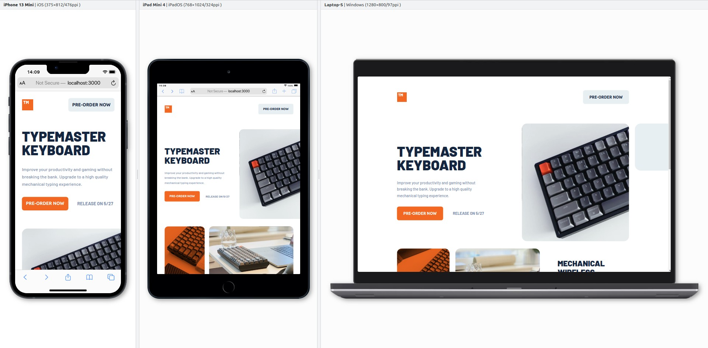

# Frontend Mentor - Typemaster pre-launch landing page solution

This is a solution to the [Typemaster pre-launch landing page challenge on Frontend Mentor](https://www.frontendmentor.io/challenges/typemaster-prelaunch-landing-page-J6-Yj5J-X). Frontend Mentor challenges help you improve your coding skills by building realistic projects.

## Table of contents

- [Frontend Mentor - Typemaster pre-launch landing page solution](#frontend-mentor---typemaster-pre-launch-landing-page-solution)
  - [Table of contents](#table-of-contents)
  - [Overview](#overview)
    - [The challenge](#the-challenge)
    - [Screenshot](#screenshot)
    - [Links](#links)
  - [My process](#my-process)
    - [Built with](#built-with)
    - [What I learned](#what-i-learned)
    - [Continued development](#continued-development)
    - [Useful resources](#useful-resources)
  - [Author](#author)

**Note: Delete this note and update the table of contents based on what sections you keep.**

## Overview

### The challenge

Users should be able to:

- View the optimal layout depending on their device's screen size.
- See hover states for interactive elements.

### Screenshot



### Links

- Solution URL: [Github repo](https://github.com/datproto/Challenges---FrontendMentor_Typemaster-prelaunch-landing-page).
- Live Site URL: [Typemaster keyboard - Solution](https://challenges-frontend-mentor-typemaster-prelaunch-landing-page.vercel.app/).

## My process

### Built with

- [React](https://reactjs.org/) - JS library.
- [Next.js](https://nextjs.org/) - React framework.
- [Tailwind CSS](https://tailwindcss.com) - CSS library.

### What I learned

This project is quite easy for me, but it still brought good experiences.

Especially, I had learned how to custom my style inline without creating new css files (For example: Change background image on different screen size), by using the cool features of <b>Tailwind CSS 3.0</b>.

```html
<div
  className="
    relative flex w-96 h-80
    bg-no-repeat bg-[length:auto_100%] 
    bg-[url('/assets/mobile/image-keyboard.jpg')]
    md:bg-[url('/assets/tablet/image-keyboard.jpg')]
    xl:bg-[url('/assets/desktop/image-keyboard.jpg')]
    md:w-[540px] md:h-[480px] md:-mr-16 xl:mr-0
    after:hidden xl:after:block after:absolute after:p-24 after:bg-gray after:top-0 after:-right-[13.5rem] after:rounded-3xl
    rounded-[1.25rem]
  "
/>
```

### Continued development

This project only requires to create static layout, but I want to add more features, such as:

- Add a Storybook for this project.
- Add animation to reveal images / icons.
- Transition on button or other components.
- Config images' size for bigger screen (FullHD, Retina etc.)
- Add more components such as Order form, or pages such as Buying Cart.
- etc.

### Useful resources

- [NextJS Doc](https://nextjs.org/docs).
- [Tailwindcss Doc](https://tailwindcss.com/docs) - The best existed CSS library and it is also my most favourite CSS library.
- [Blisk browser](https://blisk.io) - My current main browser for web development.

## Author

- Website - [Dat Proto](https://datproto.com)
- LinkedIn - [@datdotat](https://www.linkedin.com/in/datdotat/)
- Twitter - [@datproto1997](https://www.twitter.com/datproto1997)
- Github - [@datdotatprotocol](https://github.com/datdotatprotocol)
- Codewars - [@datprotocol](https://www.codewars.com/users/datprotocol)
- Frontend Mentor - [@datproto](https://www.frontendmentor.io/profile/datproto)
